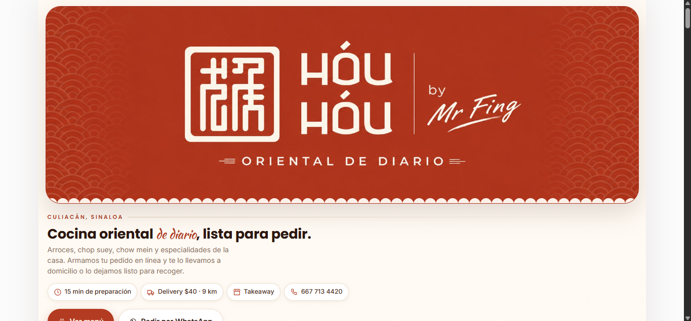
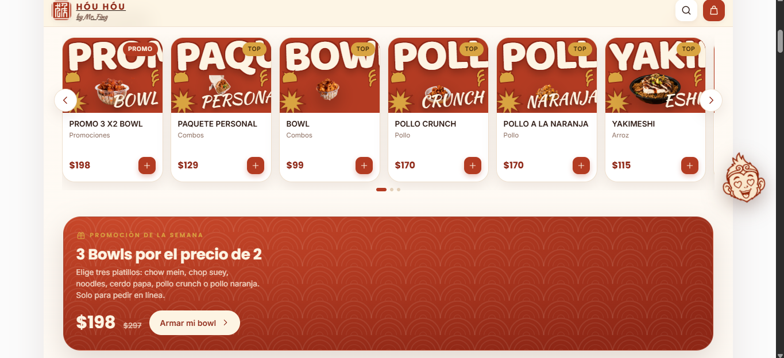
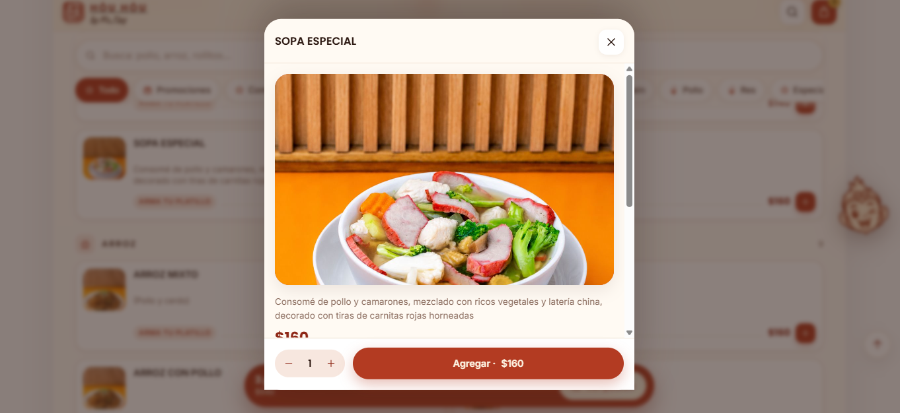
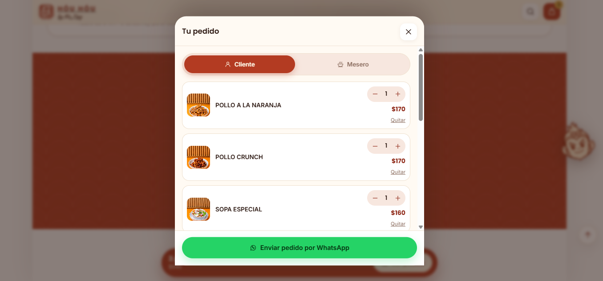

# 🥡 Hóu Hóu — Menú digital con pedidos directos a WhatsApp

> **Demo comercial** para **Hóu Hóu · by Mr. Fing — comida china en Culiacán, Sinaloa**.
> Este repositorio es una **vitrina**: muestra el resultado y la galería; el **código fuente es privado**.

## 🚀 Probar la demo

**👉 [demo-houhou.vercel.app](https://demo-houhou.vercel.app)** — funciona en móvil y escritorio, sin instalación.

---

## 📸 Galería

| Vista inicial | Catálogo y promociones |
|---|---|
|  |  |

| Ficha de producto | Pedido listo para WhatsApp |
|---|---|
|  |  |

---

## ✨ Qué incluye

- **Catálogo interactivo** con buscador, categorías, fotos reales y precios siempre actualizados.
- **Carrito de pedidos** con cantidades, notas para la cocina y modos *Delivery / Takeaway / Mesa con mesero*.
- **El momento clave:** al confirmar, se abre WhatsApp con el pedido **ya desglosado, con total, dirección y datos del cliente** — sin que nadie escriba la orden a mano.
- **Promociones destacadas** (banner de promo de la semana) para mover lo que conviene vender.
- **Diseño 100% con la identidad del negocio**: paleta, tipografía y logo propios, no una plantilla genérica.
- **Carga instantánea** (HTML/CSS/JS puro, sin frameworks) y **SEO local** con datos estructurados de horario, dirección y contacto.

## 🔄 Cómo funciona para el cliente

1. Entra desde el enlace o un **código QR** en la mesa/redes.
2. Elige sus platillos y arma el pedido en **3 clics**.
3. Toca *“Enviar pedido por WhatsApp”*: el negocio recibe la comanda **estructurada y calculada** en su chat.

## 🛠️ Tecnologías

`HTML5` · `CSS3` a medida · `JavaScript` vanilla · **Vercel** (CDN global + SSL)

> Sin bases de datos ni servidores: solución estática de bajo costo y cero mantenimiento. El menú se parametriza (logo, colores, productos, teléfono) para adaptarlo a cualquier negocio en menos de una hora.

## 📌 Sobre este repositorio

- ✅ Repositorio **público de vitrina** (imágenes + enlace a la demo en vivo).
- 🔒 El **código fuente no se publica** y el **fork está desactivado**: la plantilla es propiedad de su autor.
- ⚠️ Prototipo creado como propuesta comercial de demostración; **no está afiliado ni respaldado** por el negocio mostrado.

## 📈 ¿Quieres algo así para tu negocio?

Soy **Gustavo Heredia** — TSU en Informática, desarrollo menús digitales y sistemas de pedidos para restaurantes, cafeterías y negocios locales.

- **LinkedIn:** [gustavo-heredia-01567a2b5](https://www.linkedin.com/in/gustavo-heredia-01567a2b5/)
- **Correo:** newpersonal98@gmail.com
- **GitHub:** [Gustav0H2O](https://github.com/Gustav0H2O)

Escríbeme y te devuelvo una demo **con tu marca** en 24–48 h, sin costo ni compromiso.
